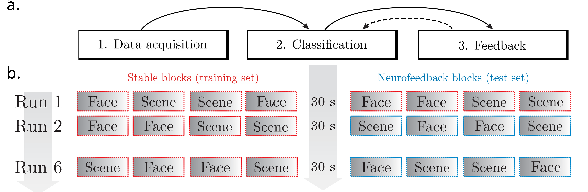

# Closed-Loop EEG Neurofeedback System

This GitHub contains code for running a closed-loop, real-time EEG neurofeedback system. 

A video demo of the neurofeedback system is available [here](https://www.youtube.com/watch?v=Ns8AHIg_Wtc&feature=youtu.be). Sample data is available [here](https://data.mendeley.com/datasets/sfwkmvmmd5/1).

The framework is:
1. Written using exclusively Python source code for a high degree of modularity and transparency.
2. A fully automated, real-time implementation without the need for any manual throughout the neurofeedback session.
3. Not dependent on any preliminary EEG recordings prior to the neurofeedback session.
4. Feasible to run using consumer-grade, portable EEG acquisition equipment with dry electrodes.
5. Robust to decoding of cognitive states across intra- and inter-individidual variability.

The framework is initially designed for a visual attention paradigm ([deBettencourt et al., 2015](https://www.nature.com/articles/nn.3940)), where the subjective attentional state of the participant is decoded in real-time and used to update the subsequent visual stimuli to modulate the attentional state using feedback.

The system can easily be adapted for various visual paradigms (see **Stimuli**).

## Running the system
1) Set up experimental, recording, preprocessing and classification parameters in *settings.py*.
2) Start recording using the EEG equipment (we used [Enobio 32](https://www.neuroelectrics.com/products/enobio/. The most widely used M/EGG hardware devices are supported though Lab Streaming Layer, LSL).
3)	Start *runSystem.py* (the script will wait for initialization of step 3). 
4)	In a different terminal/console, start *runExperiment.py* (initializes the experimental script). 

Visualization of the major components of the system:

The system requires images for the visual paradigm (see **Stimuli**). The recorded EEG data will be saved in the \ClosedLoop\subjectsData folder (see “Saving data”).

## Stimuli
The current paradigm uses composite images (an overlay of two images from different categories). Any image stimuli can be used. The stimuli are provided by a .csv file, as illustrated below:

The number of rows correspond to the number of experimental trials.

For the current paradigm, the .csv file can be generated using the script *prepareImageStimuli.py*. This requires images in the folders in \ClosedLoop\imageStimuli\. The script assumes four different image categories: male, female, indoor, outdoor (*prepareImageStimuli.py*). For the face images we used the [FERET database](https://www.nist.gov/itl/iad/image-group/color-feret-database) and for the scene images we used the [SUN database](https://groups.csail.mit.edu/vision/SUN/).
The .csv file will be saved in  \ClosedLoop\subjectsData\subjectID\ (corresponding to the subjectID specified in *settings.py*.

Non-composite images can also be generated using the function *createNonFusedIndices* in *experimentFunctions.py* and run using the function *prepNonFusedImage* instead of fuseImage in either runBehDay for the behavioral paradigm, and runNFday for the neurofeedback paradigm.

## Experimental paradigm
Participants had to respond to and, by extension, focus their attention towards subcategories of faces: female and male, and scenes: indoor and outdoor. Stimuli were composite images of the two categories (equal image mixture ratio, alpha, during training blocks). During feedback blocks, the decoded task-relevant EEG representation was used to continuously update the image mixture of the stimuli in a closed-loop manner. If participants attended well (high levels of task-relevant information in their brain) the task-relevant image became easier to see, and vice versa (see [deBettencourt et al., 2015](https://www.nature.com/articles/nn.3940)).

The experiment contains behavioral days (visual stimuli presentation without EEG recording) and a neurofeedback day (EEG recording and neurofeedback during visual stimuli presentation). 

The experimental structure for the neurofeedback day is as follows:

Participants completed six task runs consisting of eight blocks each. Every block (graded box) consisted of 50 trials displayed successively for one second each. The blocks with a red, dashed outline are denoted as 'stable' blocks, and the blue blocks are denoted as 'feedback' blocks. 

All experimental parameters (e.g. number of runs, blocks, images within each block, stimuli presentation time) can be changed in *settings.py*.  

For the neurofeedback paradigm, the first 12 blocks (illustrated as boxes with a red, dashed outline) are used for recording EEG data. A classifier is trained based on these blocks, and used to provide feedback in the subsequent neurofeedback blocks (illustrated as boxes with a blue, dashed outline). This is followed by runs consisting of 4 blocks of recording EEG (‘stable’ blocks) and 4 blocks of providing feedback (‘feedback’ blocks). 

## Saving data
The data will be stored and saved in the subject's folder \ClosedLoop\subjectsData\subjectID\. The .csv file containing image stimuli also has to be located in this folder (see **Stimuli**).

*runExperiment.py* will save the following files after a completed neurofeedback session:
-	subject_01_EEG_TIMESTAMP.csv: All of the recorded, raw EEG data. 
-	subject_01_marker_TIMESTAMP.csv: All the markers (time points of stimuli/EEG epoch onset) for experimental trials. 
-	stream_logfile_subject_01_TIMETAMP.log: A log of the EEG streaming (created by runClosedLoop.py and streamFunctions.py).
-	imageTime_subjID_01_day_2_TIMESTAMP.csv: All time points of stimuli onsets. Same clock as in the two files below.
-	PsychoPyLog_subjID_01_day_2_TIMESTAMP.csv: Log of all changes in the experimental window (using [PsychoPy logging](http://www.psychopy.org/coder/codeLogging.html)).
-	Keypress_subjID_01_day_2_TIMESTAMP.csv: Time points for all recorded keypresses during the experiment.
-	alpha_subjID_01.csv: The computed alpha values (image mixture interpolation factor, see **Experimental paradigm**) used to update image stimuli during ‘feedback’ blocks.
-	MEAN_alpha_subjID_01_day_2_TIMESTAMP.csv: The mean alpha values used to update image stimuli during ‘feedback’ blocks.

# Description of scripts
### settings.py
Set up experimental, recording, preprocessing and classification parameters.

### runSystem.py
*runSystem.py* must be started before *runExperiment.py*, since it waits for a marker (trigger point for stimuli onset) from the experimental script which is called in *runExperiment.py*.

*runSystem.py* will stream the EEG data. The EEG sampling rate, number of channels and epoch length can be changed in this script. Based on the experimental structure, the script will change the system states among:

1) ‘stable’ (Data acquisition: Recording of EEG data. No feedback provided)
2) ‘train’ (Classification: Identification of artifactual data components and training of the decoding classifier)
3) ‘feedback’ (Neurofeedback: Update of the stimulus on a trial-to-trial basis based on the decoding classifier)

### realtimeFunctions.py
Functions for working with real-time EEG data in Python:
Standardizing, scaling, artifact correction (SSP projection), preprocessing, classification.
The functions are called in *runClosedLoop.py*.

### streamFunctions.py
Functions for finding the EEG stream and the experimental stream containing markers (trigger points for stimuli onset, from experimental script: *experimentFunctions.py*), saving data, writing log files and changing system states for the neurofeedback system.
The functions are called in *runClosedLoop.py*.

### runExperiment.py
*runExperiment.py* starts the experimental script. As explained in **Experimental paradigm**, the paradigm consists of behavioral days (day 1 and 3), and a neurofeedback day (day 2). 

For the behavioral experiment, the function *runBehDay* from *experimentFunctions.py* is used.  
For the neurofeedback experiment, the function *runNFday* from *experimentFunctions.py* is used.

A simple .txt file named “feedback_subjID_01.txt” has to be located in the subject’s folder containing 1 in the first row and their own subject ID in the second line (example provided in \ClosedLoop\subjectsData\01\). 
This feedback .txt file provides an opportunity to make participants function as controls, and hence receive yoked, sham neurofeedback (feedback based on another participant’s brain response). In this case, the .txt file has to contain 0 in the first row, and the subject ID of the matched neurofeedback participant in the second row.

### experimentFunctions.py
Functions for running the PsychoPy experimental script and generating stimuli for the experiment.
The functions are called in *runExperiment.py*.

## Additional scripts (not necessary for running the system)

1)	*randomizeParticipants.py*: Functions for automated randomization of participants into 'feedback' participants or matched controls. Generates the “feedback_subjID_X.txt file in the subject's folder \ClosedLoop\subjectData\subjectID\, denoting whether a participant is feedback (first row containing 1) or control (first row containing 0).

2) Offline analysis: Code for offline analyses of data (EEG data as well as behavioral data) can be found in the [ClosedLoop_Offline GitHub](https://github.com/gretatuckute/ClosedLoop_Offline).

## Dependencies/acknowledgements:
- [PsychoPy](https://www.psychopy.org/)
- [MNE](https://mne-tools.github.io/stable/index.html) 
- [Lab Streaming Layer](https://github.com/sccn/labstreaminglayer)
- [NumPy](https://www.numpy.org/)
- [Scikit-Learn](https://scikit-learn.org/stable/)

## Reference
Paper: Tuckute et al., 2019: *"A framework for closed-loop neurofeedback for real-time EEG decoding"* in prep. 

*Cognitive Systems, Department of Applied Mathematics and Computer Science, Technical University of Denmark, 2018-19* 

In collaboration with Dr. [Sofie Therese Hansen](https://github.com/STherese) and Professor Lars Kai Hansen.
